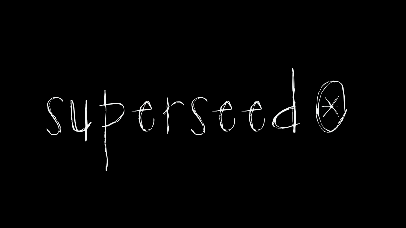

# Superseed node

Superseed is an Ethereum Layer 2 that rewards those who DeFi. It's built on Optimism's open-source [OP Stack](https://stack.optimism.io/).

This repository contains the relevant Docker builds to run your own node on the Superseed network.
